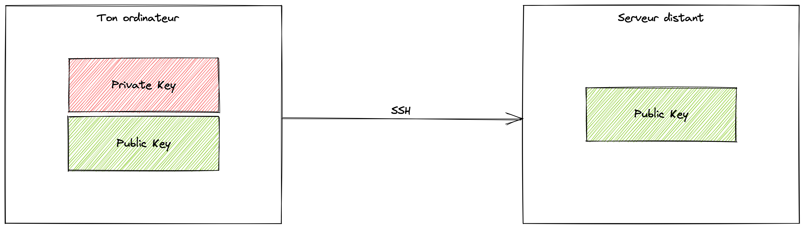
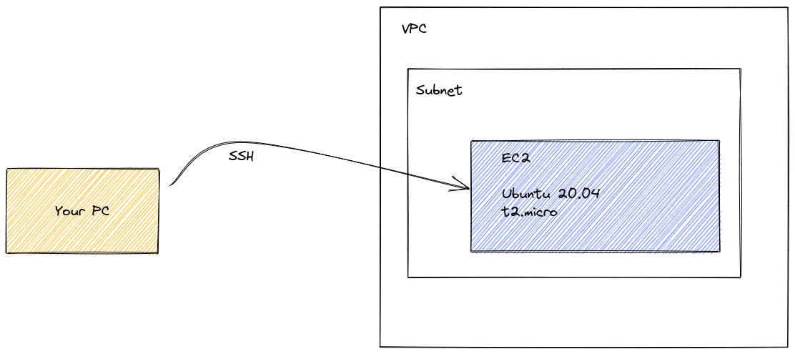

# Déployer une VM sur AWS avec Terraform

Welcome !

## Objectifs du Dojo

Les objectifs du dojo, sont une découverte du DevOps par :

- L'apprentissage ou la révision du protocole SSH
- L'utilisation de l'Infrastructure as Code avec Terraform
- Le déployement d'une VM (Machine Virtuelle) sur AWS avec Terraform
- La mise en oeuvre des apprentissages sur le protocole SSH pour se connecter à distance à la VM sur AWS

Ce dojo est organisé en plusieurs parties. Pour chaque exercice, un ou plusieurs indices sont fournis, essayer de prendre le temps de chercher par toi même et d'utiliser les indices judicieusement. Ne reste tout de même pas bloqué sur un problème ou une question, n'hésite pas à demander de l'aide, des clarifications ou des approfondissements !

## Partie 1 - Protocole SSH

> SSH™ (ou Secure SHell) est un protocole qui facilite les connexions sécurisées entre deux systèmes à l'aide d'une architecture client/serveur et permet aux utilisateurs de se connecter à distance à des systèmes hôte de serveurs.Toutefois, contrairement à d'autres protocoles de communication à distance, tels que FTP ou Telnet, SSH crypte la session de connexion et empêche ainsi tout agresseur de recueillir des mots de passe non-cryptés.

Source : [MIT](https://web.mit.edu/rhel-doc/4/RH-DOCS/rhel-rg-fr-4/ch-ssh.html)

En lisant cette courte présentation, on comprend rapidement que le protocole SSH est un incontournable en ce qui concerne la sécurité. Mais comment fonctionne-t-il ?

### Théorie - Une histoire de clés

Le procotole SSH semble à première vue être un outil assez complexe. Pourtant, pas du tout !

Il faut simplement comprendre l'enchaînement de plusieurs systèmes de chiffrement de l'information. SSH va en utiliser 3 :

- les clés symétriques
- les clés asymétriques
- le hash

Pour compléter les explications sur le fonctionnement d'SSH, de nombreux articles existent sur Internet.

Tu peux par exemple lire [celui-ci](https://medium.com/@hellomudit/understanding-ssh-workflow-66a0e8d4bf65) pour revoir les concepts, puis [celui-là](https://www.hostinger.com/tutorials/ssh-tutorial-how-does-ssh-work) pour comprendre le fonctionnement interne du programme 🙂

Une fois toutes ces clés échangées, le client et le serveur SSH peuvent enfin communiquer de manière sécurisée !

### Théorie - Protocole SSH dans la pratique

Au quotidien, le SSH va principalement servir à 2 choses :

- accéder à un terminal sur un serveur distant
- ouvrir un tunnel entre un port de son ordinateur jusqu'à un serveur distant (aussi appelé `port forwarding`)

Le principe est toujours le même : le SSH utilise des clés. Une analogie très simple pour le comprendre : la clé privée, c'est la clé qu'on a sur un trousseau. La clé publique est comme une serrure, sauf qu'on peut partager cette serrure partout. Si on a notre serrure sur une porte, on peut ouvrir la porte. Pour que plusieurs personnes accèdent à la même maison, il suffit qu'ils aient une serrure sur la porte, qui permet de l'ouvrir avec leur clé !



La clé privée est, comme son nom l'indique, privée. Il faut absolument la garder pour soi. Pour donner accès à un serveur distant à quelqu'un, on va donc lui demander sa clé publique (sa serrure), afin de pouvoir, la mettre en place sur le serveur distant.

### Exercice - Créons notre première clé SSH

Pour cet exercice, nous allons générer notre premier couple de clés SSH ! Pour rappel, ce sont les clés qui permettent le chiffrement/déchiffrement de manière asymétrique, soit la deuxième étape du protocole SSH. Mais avant, il faut savoir qu'il en existe de plusieurs types.

- [ ] Regarde les différentes méthodes de chiffrement existantes

Il existe des [comparatifs](https://goteleport.com/blog/comparing-ssh-keys/) qui comparent ces différentes méthodes de chiffrement. Ce qu'il faut retenir, en substance, c'est que le type RSA est le plus répandu, là où le EDDSA (ed25519), est plus sécurisé, mais n'est parfois pas supporté.

- [ ] Génère un couple de clé à l'aide de la commande `ssh-keygen` et protège la clé privée avec un mot de passe

Pour cela, commence par te rendre dans le dossier `~/.ssh`. Il faudra peut-être le créer s'il n'existe pas. Tu peux choisir un type ou un autre librement pour cet exercice. Si tu utilises une clé RSA, tu peux également choisir sa taille : 4096 bits est la recommandation actuelle.

<details>
<summary>💡 Indice 1</summary>

N'hésite pas à utiliser `man ssh-keygen` pour connaître les paramètres à utiliser de la commande.

</details>

<details>
<summary>💡 Indice 2</summary>

Pour connaître les différentes options du paramètre `-t` qui définit le type de clef tu peux utiliser "TAB" :

```bash
$ ssh-keygen -t <TAB>
dsa      ecdsa    ed25519  rsa
```

</details>

<details>
<summary>💡 Indice 3</summary>

La commande complète est la suivante :

```bash
$ cd ~/.ssh

$ ssh-keygen -t rsa -b 4096
# ou
$ ssh-keygen -t ed25519
```

La suite sera quasiment la même : le générateur va demander un nom (par défaut, ce sera id_rsa ou id_ed25519 selon le type de clé choisi), puis un mot de passe, optionnel mais très recommandé pour protéger son accès, et sa confirmation. Disposer d'un mot de passe sur sa clé privée rajoute une couche de sécurité : si un attaquant arrive à la dérober d'une quelconque manière, il ne pourra pas l'utiliser. Enfin, la clé sera générée, et une image sera affichée, représentant le côté aléatoire de la clé.

```bash
ssh-keygen -t ed25519
Generating public/private ed25519 key pair.
Enter file in which to save the key (/Users/pyrrha/.ssh/id_ed25519): dojo-padok
Enter passphrase (empty for no passphrase):
Enter same passphrase again:
Your identification has been saved in dojo-padok
Your public key has been saved in dojo-padok.pub
The key fingerprint is:
SHA256:FK44tKx/qfXCYLzEcWR8X5WJQrfcopm0FERJks4usXI pyrrha@MacBook-Pro-de-Pyrrha.local
The key's randomart image is:
+--[ED25519 256]--+
|     .  o**..o.o |
|      +.ooo+ooo  |
|    .o +o.oo+ .  |
|   o.ooooo.= .   |
|   o=o.+S =      |
|   .B.E .        |
|  .o *.o         |
|   ...=.         |
|    oo ..        |
+----[SHA256]-----+
```

</details>

- [ ] Vérifie la création de ton couple de clés (une publique et une privée) dans ton dossier `~/.ssh`

<details>
<summary>💡 Indice 1</summary>

Un `ls` te permettra de voir 2 clés :

```bash
$ ls
ed25519     ed25519.pub
```

Sans surprise : la première est la clé privée, à ne jamais partager, et la seconde est la clé publique. N'hésite pas à afficher leur contenu (avec `cat` par exemple) pour voir à quoi ça ressemble !

</details>

## Partie 2 - Déployer une VM sur AWS avec Terraform

L'objectif de cette partie est de prendre en main Terraform et de déployer une VM (Machine Virtuelle).

### Prérequis

#### Installation - Terraform

Tu dois en premier lieu [installer Terraform](https://learn.hashicorp.com/tutorials/terraform/install-cli#install-terraform) sur ta machine.

Exemple d'installation avec Homebrew :

- [ ] `brew tap hashicorp/tap`
- [ ] `brew install hashicorp/tap/terraform`
- [ ] `brew update`
- [ ] `brew upgrade hashicorp/tap/terraform`
- [ ] Vérifie que Terraform est bien installé `terraform -help`

#### Théorie - Terraform

Terraform est un outil d'« infrastructure as code » publié en open-source par la société HashiCorp.
Terraform permet d'automatiser le déployement d'une infrastructure et de ses différentes ressources (réseau, base de données, VMs...).

Pour chaque ressource, il existe une documentation associée :

- Par exemple je veux déployer un VPC sur AWS
- Je peux trouver la documentation associé [ici](https://registry.terraform.io/providers/hashicorp/aws/latest/docs/resources/vpc)
- *Tips: je tape le nom de la ressource + Terraform dans Google et c'est souvent le premier lien*

Les commandes à retenir :

- [ ] [`terraform init`](https://www.terraform.io/cli/commands/init) est utilisé pour initialiser un répertoire de travail contenant les fichiers de configuration de Terraform. Il s'agit de la première commande à exécuter après l'écriture d'une nouvelle configuration Terraform.
- [ ] [`terraform plan`](https://www.terraform.io/cli/commands/plan) créé un plan d'exécution, qui permet de prévisualiser les modifications que Terraform prévoit d'apporter à l'infrastructure.
- [ ] [`terraform apply`](https://www.terraform.io/cli/commands/apply) execute les actions proposées lors du plan.
- [ ] [`terraform destroy`](https://www.terraform.io/cli/commands/destroy) est un moyen pratique de détruire tous les objets gérés par une configuration.

#### Installation - Configuration AWS

Pour déployer une VM sur AWS, tu vas avoir besoin de mettre en place ta configuration sur AWS.

Tu peux suivre les instructions suivantes pour installer le CLI `aws` sur la [page de documentation AWS](https://docs.aws.amazon.com/fr_fr/cli/latest/userguide/getting-started-install.html)

Puis, pour mettre en place ton profile de connexion à l'aide d'une Access Key (qui va te permettre de te connecter à AWS), lance les commandes suivantes :

```bash
mkdir ~/.aws
cat  << EOF > ~/.aws/credentials
[padok-dojo-decouverte]
aws_access_key_id = <ACCESS_KEY>
aws_secret_access_key = <SECRET_KEY>
EOF
cat  << EOF > ~/.aws/config
[profile padok-dojo-decouverte]
region = eu-west-2
output = json
EOF
```

Le fichier `~/.aws/credentials` contient l'access key et la secret key qui permettent de te connecter au compte AWS.
Le fichier `~/.aws/config` permet de paramétrer un profil de connexion que l'on va utiliser dans le code Terraform.

### Théorie - Provider & Backend

Au début de chaque projet Terraform, il y a un peu de configuration à faire. La configuration a déjà été faites, voilà les détails de celle-ci pour la comprendre.

Terraform utilise les APIs des cloud provider pour créer les ressources qu'on défini dans nos fichiers. Mais pour qu'il sache quelle API utiliser, c'est à dire sur quel environnement on va déployer, il faut lui donner un peu de configuration.

Terraform fonctionne avec un fichier de state (le fichier dans lequel Terraform sauvegarde toute la configuration de l'infrastructure qu'il déploie). Lorsqu'on travail en groupe, le fichier state doit être sauvegardé ailleurs qu'en local. Pour cela on utilise un backend (bucket sur AWS ou GCP) et le configure dans un fichier de configuration `backend.tf`. Lors du `terraform init`, Terraform ira télécharger le state en local, et re-uploadera une nouvelle version une fois les changements appliqués. Dans notre cas, le backend est local.

Dans le dossier infrastructure, il y a donc :

- Un fichier `_provider.tf` (https://registry.terraform.io/providers/hashicorp/aws/latest/docs)
- Un fichier `_backend.tf` (https://www.terraform.io/language/settings/backends/configuration)

### Théorie - Réseau

Avant de commencer à déployer une machine virtuelle sur AWS, il faut d'abord avoir un réseau. Celui-ci a déjà été déployé en amont.
Voici un schéma simple du réseau qui a été déployé pour permettre de déployer la VM et de s'y connecter :



Ce schéma contient :

- Un VPC (Virtual Private Network)
- Un subnet public (un sous-réseau)
- Une EC2 (une machine virtuelle) qui n'est pas encore déployé !

### Exercice - Déployer une VM (Instance EC2)

Une machine virtuelle correspond sur AWS à une instance EC2.
On veut créer une machine virtuelle Ubuntu 20.04 dans le sous-réseau (subnet) déjà déployé. Celle-ci doit contenir notre clé SSH pour pouvoir s'y connecter.

Pour la déployer suit les étapes suivantes :

- [ ] Complète la ressource `aws_instance` dans le fichier `main.tf` en ajoutant tous les paramètres manquants (`# To add` dans le code) et si besoin, en suivant les paramètres sur le schéma ci dessus.

<details>
<summary>💡 Indice 1</summary>

La [documentation Terraform](https://registry.terraform.io/providers/hashicorp/aws/latest/docs/resources/instance) pour déployer une EC2 contient des exemples et les paramètres demandés.

</details>

<details>
<summary>💡 Indice 2</summary>

Le type d'instance a choisir est défini dans le schéma.

</details>

<details>
<summary>💡 Indice 3</summary>

Le paramètre `associate_public_ip_address` attend comme valeur `true` ou `false`.
As-t-on besoin d'associer une adresse IP Publique ?

</details>

<details>
<summary>💡 Indice 4</summary>

Le fichier `variables.tf` contient probablement une variable utile pour définir le subnet.

</details>

<details>
<summary>💡 Solution</summary>

```
resource "aws_instance" "public" {
  ami           = data.aws_ami.ubuntu.id
  instance_type = "t3.micro"

  private_ip                  = "172.16.10.100"
  associate_public_ip_address = true
  key_name                    = aws_key_pair.deployer.key_name

  vpc_security_group_ids = [
    aws_security_group.allow_public_ssh.id
  ]
  subnet_id = var.public_subnet
  tags = {
    Name = "dojo-decouverte"
  }

  user_data                   = templatefile("./userdata.yaml.tpl", {})
  user_data_replace_on_change = true
}
```

</details>

- [ ] Renseigne ta clé publique (créée en partie 1 du dojo) dans la variable `ssh_key` du fichier `terraform.tfvars`
- [ ] Complète la ressource `aws_key_pair` dans le fichier `main.tf` en ajoutant le paramètre manquant (`# To add` dans le code).

<details>
<summary>💡 Indice 1</summary>

Utilise la variable disponible dans le fichier `variables.tf` à ta disposition.

</details>

<details>
<summary>💡 Solution</summary>

```
resource "aws_key_pair" "deployer" {
  key_name   = "ec2-key"
  public_key = var.ssh_key
}
```

</details>

- [ ] Initie ton répertoire de travail avec la commande `terraform init` dans le dossier infrastructure
- [ ] Prévisualise ton exécution avec la commande `terraform plan` dans le dossier infrastructure
- [ ] Crée la VM via Terraform avec la commande `terraform apply`  dans le dossier infrastructure

À la fin de l'exécution de la commande `terraform apply`, on peut voir une information dans les outputs qui est l'IP de l'instance publique : `public_instance_ip = "X.X.X.X"`

## Partie 3 - Se connecter en SSH à la VM déployée

Après l'étape 2 et que le déployement à l'aide de `terraform apply`, on a obtenu une instance EC2 publique sur notre réseau.

On voudrait se connecter à l'instance EC2 publique via SSH. L'instance est désignée comme publique car on lui a associé une adresse IP publique que l'on peut donc atteindre via internet. Si cette instance a une IP publique, elle a aussi une IP privée qui est celle qu'elle possède dans son sous-réseau. Elle a pour forme `172.16.X.X`

### Exercice - Se connecter à l'instance publique via SSH

L'utilisateur Linux de l'instance que l'on pourra utiliser est `ubuntu`

> ℹ️ À savoir
>
> Lorsque l'on va se connecter à un serveur en SSH, on va se présenter en tant qu'un utilisateur qui existe sur le serveur SSH. Pour chaque utilisateur, le serveur va chercher par défaut le fichier ~/.ssh/authorized_keys et regarder les clés publiques de l'utilisateur. Cela va lui permettre de vérifier que l'utilisateur est bien le bon.

- [ ] Utiliser une commande ssh pour se connecter à l'instance créée à l'aide de la clé SSH et de l'IP Publique de l'instance.
On va rapidement se rendre compte que la commande timeout : il semblerait qu'il y ait un blocage réseau !

<details>
<summary>💡 Indice 1</summary>

On va vouloir utiliser la commande `ssh <user>@<ip>`
Ici, nous avons placé notre clé publique dans l'instance avec le compte de l'utilisateur `ubuntu`. On peut donc se connecter comme suit :

```bash
ssh -i ~/.ssh/ed25519 ubuntu@<public_ip>
```

</details>

La commande utilisée se décompose de la manière suivante :

- `ssh` : l'exécutable appelé pour se connecter en ssh
- `-i ~/.ssh/ed25519` : indique la clé **privée** à utiliser (la clé pour la serrure)
- `ubuntu` : l'utilisateur qui existe sur le serveur distant (root est le superadmin des machines Linux)
- `@` : sépare l'utilisateur et l'adresse IP de la machine
- `<public_ip>` : l'adresse où est accessible le serveur distant, ici notre instance ec2

### Exercice - Autoriser le trafic SSH en entrée sur l'instance publique

Pour résoudre ce problème, il va falloir s'intéresser à une ressource AWS que l'on peut rattacher aux instances : les security groups.
Ce sont grosso-modo des firewalls, ils contiennent des règles qui vont autoriser du trafic entre une source et une destination.

Petit point d'attention : on ne peut que faire des autorisations via les security groups, il n'y a pas de notion d'interdiction, qui est en fait le caractère par défaut de la ressource.

Si l'on regarde le security group définit dans le fichier `main.tf`, on peut remarquer qu'il n'y a aucune règle "Inbound" (ou "ingress") : cela veut dire qu'aucun trafic n'est autorisé en entrée.

- [ ] Ajouter une règle Inbound autorisant la connexion SSH sur l'instance dans la ressource `aws_security_group` dans le fichier `main.tf`
Après avoir ajouté la règle : réessayer la connexion SSH, cela devrait fonctionner !

<details>
<summary>💡 Indice 1</summary>

La [documentation Terraform](https://registry.terraform.io/providers/hashicorp/aws/latest/docs/resources/security_group) pour déployer un security group contient des exemples et les paramètres demandés.

On va vouloir éditer les règles du security group et autoriser le trafic SSH provenant de n'importe où.

</details>

<details>
<summary>💡 Indice 2</summary>

Il faut ajouter un block `ingress` dans la ressource `aws_security_group` pour autoriser le trafic SSH provenant de n'importe où.

</details>

<details>
<summary>💡 Indice 3</summary>

Le port utilisé par SSH est le port TCP 22. Et le protocole tcp.

</details>

<details>
<summary>💡 Indice 4</summary>

Pour la source, on peut utiliser "Anywhere-IPv4" qui est équivalent au CIDR `0.0.0.0/0`.

</details>

<details>
<summary>💡 Solution</summary>

```
resource "aws_security_group" "allow_public_ssh" {
  name        = "ec2-public-ssh"
  vpc_id      = var.vpc_id
  description = "Allows access to SSH Port"

  # Allow all outbound
  egress {
    from_port   = 0
    to_port     = 0
    protocol    = "-1"
    cidr_blocks = ["0.0.0.0/0"]
  }
  # Allow ssh inbound
  ingress {
    from_port   = 0
    to_port     = 22
    protocol    = "tcp"
    cidr_blocks = ["0.0.0.0/0"]
  }
  lifecycle {
    create_before_destroy = true
  }

  tags = {
    Name = "dojo-decouverte"
  }
```

</details>

### Trouve le flag !

Un mini flag est à trouver dans la VM une fois connecté sur celle-ci !

## Cleaning

Avant de partir lance un `terraform destroy` pour supprimer toutes les ressources créées. Merci

## Bonus

Pour aller plus loin, tu peux créer une instance EC2 privée, c'est-à-dire une VM qui ne possède pas d'IP publique et n'est donc pas accessible depuis l'exterieur du réseau privé.
Tu peux ensuite t'y connecter en SSH en utilisant des "jumps" qui permettent de passer par l'instance public pour accéder à l'instance privée.

N'hésite pas à demander de l'aide pour cette partie non guidée.

# LICENSE

© 2022 [Padok](https://www.padok.fr/).

Licensed under the [Apache License](https://www.apache.org/licenses/LICENSE-2.0), Version 2.0 ([LICENSE](./LICENSE))
